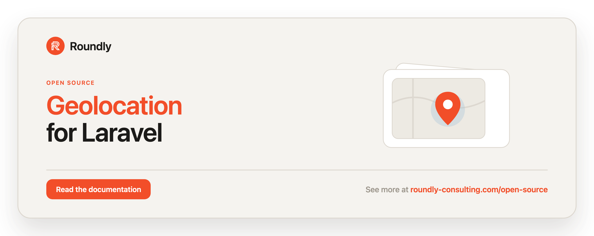

<!-- roundly-hero:start -->
<p align="center">
  <a href="https://roundly-consulting.com/open-source/docs/geolocation-for-laravel?utm_source=github&utm_medium=readme&utm_campaign=open-source&utm_content=geolocation-for-laravel">
    
  </a>
</p>
<!-- roundly-hero:end -->

<!-- roundly-badges:start -->
<p align="center">
  <a href="https://packagist.org/packages/roundly-consulting/geolocation-for-laravel"></a>
  <a href="https://github.com/roundly-consulting/geolocation-for-laravel/actions/workflows/run-tests.yml"></a>
  <a href="https://github.com/roundly-consulting/geolocation-for-laravel/actions/workflows/fix-php-code-style-issues.yml"></a>
  <a href="https://donate.stripe.com/dRmeVe8FX5PF1Qd9pXcEw00"></a>
  <a href="https://www.patreon.com/cw/roundly"></a>
  <a href="https://roundly-consulting.com/support-us?utm_source=github&utm_medium=readme&utm_campaign=open-source&utm_content=geolocation-for-laravel#crypto"></a>
</p>
<!-- roundly-badges:end -->

# Geolocation for Laravel

Resolve a client's location (from an IP address, coordinates, or a street address) and the
travel distance between two points through a pluggable, provider-based pipeline. Ships with
**IPinfo**, **IP2Location**, **Google**, and **MaxMind** providers — including a fully
**native `.mmdb` reader** (no third-party MaxMind SDK) and a `geolocation:db:update` command
that downloads the database for you — plus geofencing helpers, an Eloquent coordinates cast,
a validation rule, a request macro, batch and matrix lookups, a test fake, caching, events,
and a configurable default fallback.

## Requirements

- PHP `^8.4`
- Laravel `^12.0` or `^13.0`

## Integrates with

This package builds on three other roundly-consulting packages (hard dependencies):

- **[`roundly-consulting/package-toolkit-for-laravel`](https://github.com/roundly-consulting/package-toolkit-for-laravel)** —
  the service provider is declared through its fluent `Package` builder (config, commands,
  facade alias, `php artisan about` section), and `RateLimitExceededException` implements its
  `HasRetryAfter` contract.
- **[`roundly-consulting/enums-for-laravel`](https://github.com/roundly-consulting/enums-for-laravel)** —
  the `DistanceType` and `GeolocationType` enums adopt its `Helpers` trait, so you get
  `values()`, `labels()`, `options()`/`toOptions()`, `validationRule()`, `tryFromName()`,
  `is()`/`isIn()`, and the `when*` guards for free.
- **[`roundly-consulting/http-client-rate-limits-for-laravel`](https://github.com/roundly-consulting/http-client-rate-limits-for-laravel)** —
  every outbound HTTP provider (`google`, `ipinfo`, `ip2location`, `maxmind_web`) is paced
  through its client-side limiter with adaptive `Retry-After` backoff. See
  [Rate limiting outbound requests](#rate-limiting-outbound-requests).

Until these are published to Packagist they resolve by path (sibling checkouts) locally and
by VCS on CI, so no extra setup is needed when they sit alongside this package.

### Enum helpers

```php
use RoundlyConsulting\Geolocation\Enum\DistanceType;
use RoundlyConsulting\Geolocation\Enum\GeolocationType;

DistanceType::values();            // ['Walking', 'Driving']
DistanceType::validationRule();    // 'in:Walking,Driving'
DistanceType::toOptions();         // ['Walking' => 'Walking', 'Driving' => 'Driving'] — ready for <select>

GeolocationType::values();         // ['Default', 'IP', 'Geolocation']
GeolocationType::Ip->value;        // 'IP' (wire value is preserved)
```

## Installation

```bash
composer require roundly-consulting/geolocation-for-laravel
```

The service provider is auto-discovered. Optionally publish the config file:

```bash
php artisan vendor:publish --tag="geolocation-config"
```

## How it works

The package resolves a result by walking an **ordered pipeline of named providers** and
returning the first non-null answer:

- A **`GeolocationProvider`** turns a `GeolocationQuery` (IP, coordinates, or address) into a
  `Location`.
- A **`DistanceProvider`** turns a `DistanceQuery` (two coordinate pairs + a travel mode) into
  a `Distance`.

Providers are tried in `pipeline` order; reorder them in config to change precedence. A
successful resolution can be cached and dispatches an event.

A provider whose API **cannot be reached** (timeout, DNS failure, refused connection) counts as
a miss: the pipeline moves on to the next provider instead of throwing. Its error is reported,
with credentials redacted, on the `LocationResolutionFailed` event (see [Events](#events)). A
few errors still abort the lookup on purpose: a fail-fast `RateLimitExceededException`, a
missing or corrupt MaxMind database, and any exception your own provider throws.

**An unresolved lookup is `null`.** `locate*()`, `distance()` and `distanceBetween()` return
`null` when no provider answers. An empty answer counts as no answer: a `Location` with no
address part, no country and `0,0` coordinates (`$location->isEmpty()`), such as IP2Location's
reply for a private IP, is skipped and the next provider is asked. So a `Location` you get back
always places something, though a coarse IP match can still lack a city or a country. The
`default` provider only answers once you configure a default location (any
`geolocation.default.*` value); with the shipped empty values it answers `null` as well. When it
does answer, the `Location` has `type === GeolocationType::Default`, so you can tell a fallback
from a real lookup.

### Bundled providers

| Name | Class | Location | Distance | Source |
|---|---|---|---|---|
| `maxmind_database` | `MaxMindDatabaseProvider` | yes (by IP) | no | local `.mmdb` file (native reader) |
| `maxmind_web` | `MaxMindWebServiceProvider` | yes (by IP) | no | MaxMind GeoIP2 Precision web service |
| `ip2location` | `IP2LocationProvider` | yes (by IP) | no | [ip2location.io](https://www.ip2location.io) HTTP API |
| `ipinfo` | `IpInfoProvider` | yes (by IP) | no | [ipinfo.io](https://ipinfo.io) HTTP API |
| `google` | `GoogleProvider` | yes (by coordinates **or** address) | yes | Google Geocoding + Distance Matrix |
| `default` | `DefaultLocationProvider` | yes (static fallback) | no | config values |

Both MaxMind providers are **disabled by default** and return `null` immediately until you
enable them and supply credentials / a database path.

**What calls the network by default.** With the shipped config an IP lookup sends the IP to
`api.ip2location.io` and then `ipinfo.io`, even without `IP2LOCATION_API_KEY` / `IPINFO_TOKEN`
(the request is then unauthenticated). An address or coordinate lookup, and every distance,
goes to Google (it needs `GOOGLE_MAPS_API_KEY` to succeed). `maxmind_database` and `default`
never touch the network. To keep IPs on your own servers, trim the `pipeline` (for example to
`['maxmind_database', 'default']`). In tests, `Geolocation::fake()` never calls a provider.

### Running a single provider

You don't need to configure every provider. To run exactly one, either set the `pipeline`
(and `providers`) to a single name in config, or pin it per call:

```php
Geolocation::provider('ipinfo')->locateIp($request->ip());
Geolocation::using('maxmind_database')->locateIp($request->ip());
```

`provider()` / `using()` return a **scoped copy** of the manager that consults only the named
provider(s). No other provider needs to be configured, and the shared manager is never changed,
so the scope cannot leak into later calls (even when a provider throws).

## Usage

Use the `Geolocation` facade. Every facade method is also available on an injected
`GeolocationManager` — see [Without the facade](#without-the-facade).

### One-liner helpers

```php
use RoundlyConsulting\Geolocation\Facades\Geolocation;

$location = Geolocation::locateIp('8.8.8.8');
$location = Geolocation::locateRequest();                              // auto-detects the client IP

$location?->city;           // "Mountain View"
$location?->region;         // "California"
$location?->postalCode;     // "94043"
$location?->countryIsoCode; // "US"
$location?->timezone;       // "America/Los_Angeles" (IP providers only)
$location?->latitude;       // 37.4056

$location = Geolocation::locateAddress('1600 Amphitheatre Pkwy, Mountain View');

$location?->city;           // "Mountain View"
$location?->timezone;       // "" (Google geocoding returns no timezone)
$location?->latitude;       // 37.4224
```

`Location` and `Distance` implement `Arrayable` + `JsonSerializable`, so you can return them
straight from a controller:

```php
return response()->json($location);
```

### Coordinates value object & named queries

```php
use RoundlyConsulting\Geolocation\Facades\Geolocation;
use RoundlyConsulting\Geolocation\DataTransferObjects\Coordinates;
use RoundlyConsulting\Geolocation\DataTransferObjects\GeolocationQuery;

$here = new Coordinates(48.1486, 17.1077);   // validates lat ∈ [-90,90], lng ∈ [-180,180]

$location = Geolocation::locate(GeolocationQuery::forCoordinates($here));

$metres = $here->distanceTo(new Coordinates(50.0755, 14.4378)); // Haversine, ≈ 290 km
```

### Calculate travel distance

```php
use RoundlyConsulting\Geolocation\Facades\Geolocation;
use RoundlyConsulting\Geolocation\DataTransferObjects\Coordinates;
use RoundlyConsulting\Geolocation\DataTransferObjects\DistanceQuery;
use RoundlyConsulting\Geolocation\Enum\DistanceType;

$distance = Geolocation::distance(
    DistanceQuery::between(
        from: new Coordinates(48.1482, 17.1067),
        to:   new Coordinates(49.2000, 16.6068),
        type: DistanceType::Driving,
    ),
);

$distance?->humanReadableDistance; // "133 km"
$distance?->distanceInMeters;      // 133000
$distance?->durationInSeconds;     // 5400
```

Or skip the query object — `distanceBetween()` builds it for you (driving by default):

```php
$distance = Geolocation::distanceBetween(
    new Coordinates(48.1482, 17.1067),
    new Coordinates(49.2000, 16.6068),
    DistanceType::Walking,
);
```

`locate()` / `distance()` / `distanceBetween()` return `null` when no provider can resolve the
query, including when every provider is unreachable.

### Scoping a single call to specific providers

```php
$location = Geolocation::using('maxmind_database', 'ipinfo')->locateIp($request->ip());
```

Like `provider()`, `using()` returns a scoped copy, so it applies to the whole call it is
chained to (every IP of a `batch()` included) and to nothing else.

### Batch lookups

Resolve many IPs at once. Failures are isolated per item, so the batch never aborts. A scope or
override chained before `batch()` applies to every IP:

```php
$results = Geolocation::batch(['8.8.8.8', '1.1.1.1', '203.0.113.7']);

$results['8.8.8.8']?->city;   // a Location or null per IP
```

### Distance matrix

Resolve a grid of distances between several origins and destinations in one call (Google
Distance Matrix). Unavailable legs degrade to `null`, and so does every cell when Google cannot
be reached:

```php
use RoundlyConsulting\Geolocation\DataTransferObjects\Coordinates;

$matrix = Geolocation::distanceMatrix(
    origins: [new Coordinates(48.14, 17.10)],
    destinations: [new Coordinates(49.20, 16.60), new Coordinates(50.07, 14.43)],
);

$matrix->get(0, 1)?->distanceInMeters;
```

### Caching

With `geolocation.cache.enabled`, successful lookups and distances are cached for
`cache.ttl` seconds. Failures never are, and neither is the `default` fallback: it only
answered because the real providers did not, so the next call asks them again. Scoped or
overridden calls (`provider()`, `using()`, `with*()`) bypass the cache. Drop one entry, or all
of them:

```php
use RoundlyConsulting\Geolocation\DataTransferObjects\DistanceQuery;
use RoundlyConsulting\Geolocation\DataTransferObjects\GeolocationQuery;

Geolocation::forget(GeolocationQuery::forIp('8.8.8.8'));   // true when an entry was removed
Geolocation::forget(DistanceQuery::between($from, $to));  // distances too

Geolocation::flushCache();                                 // every lookup and distance
```

`flushCache()` works on any cache store without touching other keys: cache keys carry a
generation number (`geolocation:v3:locate:…`) and a flush moves it forward, so older entries are
never read again and expire on their own TTL.

### Geofencing helpers on `Coordinates`

```php
use RoundlyConsulting\Geolocation\DataTransferObjects\Coordinates;

$here = new Coordinates(48.1486, 17.1077);

$here->near(new Coordinates(48.21, 16.37), radiusKm: 100);  // bool
$here->within([$a, $b, $c, $d]);                            // point-in-polygon, bool
$here->bearingTo($there);                                   // initial bearing, degrees
$here->midpointTo($there);                                  // Coordinates
$box = $here->boundingBox(radiusKm: 10);                    // BoundingBox
$box->contains($point);                                     // bool
```

These work across the antimeridian and near the poles: `midpointTo()` normalises the longitude
into -180..180, a bounding box that crosses ±180° wraps (`$box->crossesAntimeridian()` is then
`true` and its south-west longitude is greater than its north-east one), and a circle that
reaches a pole spans every longitude. `within()` treats each polygon edge as the shorter way
around, so a polygon drawn across the antimeridian works. A polygon that encloses a pole is not
supported.

### Storing coordinates on a model

Cast latitude/longitude columns to a `Coordinates` value object with the `HasLocation` trait,
which also adds a `withinRadius()` query scope (a cheap bounding-box pre-filter):

```php
use Illuminate\Database\Eloquent\Model;
use RoundlyConsulting\Geolocation\Concerns\HasLocation;
use RoundlyConsulting\Geolocation\DataTransferObjects\Coordinates;

final class Store extends Model
{
    use HasLocation; // casts a `coordinates` attribute over `latitude`/`longitude` columns
}

$store = new Store;
$store->coordinates = new Coordinates(48.1486, 17.1077);
$store->save();

Store::query()->withinRadius(new Coordinates(48.15, 17.11), radiusKm: 5)->get();
```

`withinRadius()` filters on the bounding box, so near the antimeridian it matches longitudes on
both sides of ±180°, and near a pole it matches every longitude. Check the exact distance in PHP
(`$center->near($store->coordinates, 5)`) when the box's corners matter.

You can also apply the cast directly: `protected $casts = ['coordinates' => CoordinatesCast::class];`.

### Validation rule & request macro

```php
use Illuminate\Validation\Rule;

$request->validate([
    'point' => [Rule::coordinates()],   // "lat,lng", [lat, lng], or ['latitude'=>…, 'longitude'=>…]
]);

$location = $request->location();        // resolves the client's Location from its IP
```

### Per-call provider overrides

Tweak a provider's credential or timeout for one call without touching global config. A
credential is vendor-specific, so `withToken()` and `withConfig()` name the provider they
target. No other provider ever sees that value. `withTimeout()` applies to every provider:

```php
Geolocation::withToken('ipinfo', 'runtime-token')->locateIp('8.8.8.8');
Geolocation::withTimeout(10)->locateIp('8.8.8.8');
Geolocation::withConfig('ipinfo', ['token' => '…', 'timeout' => 3])->locateIp('8.8.8.8');
```

Each call returns a scoped copy of the manager, so the override lasts exactly as long as the
call chain it is attached to (every IP of a `batch()` included). Naming a provider that isn't
registered throws `UnknownProviderException`.

The bundled HTTP providers read two override keys. `token` replaces the IPinfo token, the
Google or IP2Location key, or the MaxMind web license key (the account ID stays the configured
one). `timeout` replaces `geolocation.timeout`. The offline `maxmind_database` and `default`
providers read none. Your own provider can read any key passed to `withConfig()`: add the
`RoundlyConsulting\Geolocation\Concerns\HasProviderOverrides` trait and call
`$this->override('key')`, which returns `null` when the key isn't set for this call.

The `GeolocationManager` is also `Macroable`, so host apps can add their own methods.

### Without the facade

The facade is sugar over `GeolocationManager`, a container singleton — inject it and call the
same methods:

```php
use RoundlyConsulting\Geolocation\GeolocationManager;

final class CheckoutController
{
    public function __construct(private GeolocationManager $geolocation) {}

    public function __invoke(Request $request)
    {
        $location = $this->geolocation->locateRequest($request);

        $distance = $location === null
            ? null
            : $this->geolocation->distanceBetween($this->warehouse(), $location->coordinates());
        // ...
    }
}
```

The one state-changing use case, refreshing the MaxMind database, is also an action you can
resolve directly (e.g. from your own scheduled job):

```php
use RoundlyConsulting\Geolocation\Actions\UpdateDatabaseAction;

$path = app(UpdateDatabaseAction::class)->execute(edition: 'GeoLite2-City');
```

Lookups and distances have no action classes: they run through the provider pipeline, and each
provider is a remote-API client you can swap in the `providers` map.

### Testing with the fake

Swap the manager for a recording fake in your host-app tests — no network, no cache, no
download, canned results. It replaces the facade root **and** the container binding, so
injected managers and `$request->location()` are faked too:

```php
use RoundlyConsulting\Geolocation\Facades\Geolocation;

$fake = Geolocation::fake(['8.8.8.8' => $expectedLocation]);

$this->get('/checkout');   // e.g. calls Geolocation::provider('ipinfo')->locateIp($ip)

$fake->assertLocated('8.8.8.8');
$fake->assertProviderUsed('ipinfo');                // a provider pinned via provider()/using()
$fake->assertDistanceRequested(from: $warehouse);   // any argument may be omitted
$fake->assertDatabaseUpdated('GeoLite2-City');      // also records geolocation:db:update
$fake->assertForgotten(GeolocationQuery::forIp('8.8.8.8'));
$fake->assertCacheFlushed();
```

The fake runs no provider, so `assertProviderUsed()` checks the names your code pinned with
`provider()` / `using()` for a lookup, batch, distance or matrix. It does not check which
provider "would have answered". Coordinate lookups are keyed `"lat,lng"` in plain decimals
(`"0.00001,0"`, never `"1.0E-5,0"`).

Each assert has a negative twin: `assertNothingLocated()`, `assertProviderNotUsed()`,
`assertNoDistanceRequested()`, `assertDatabaseNotUpdated()`, `assertNothingForgotten()`,
`assertCacheNotFlushed()`. Seed more results fluently with `$fake->seed($key, $location)`,
`seedDefault()`, and `seedDistance()`.

### Registering a custom provider

Register a closure provider at runtime (e.g. in a service provider's `boot()`), then add its
name to the `pipeline`:

```php
use RoundlyConsulting\Geolocation\Facades\Geolocation;

Geolocation::extend('my_provider', fn () => new MyProvider());
```

Or implement `GeolocationProvider` / `DistanceProvider` and add the class to the `providers`
map. Providers are resolved from the container, so constructor dependencies are injected.

```php
use RoundlyConsulting\Geolocation\DataTransferObjects\GeolocationQuery;
use RoundlyConsulting\Geolocation\DataTransferObjects\Location;
use RoundlyConsulting\Geolocation\GeolocationProvider;

final class MyProvider implements GeolocationProvider
{
    public function locate(GeolocationQuery $query): ?Location
    {
        // Return a Location, or null to defer to the next provider. An empty Location
        // (`$location->isEmpty()`) defers too.
    }
}
```

### Events

When `geolocation.events.enabled` is true (the default), the manager dispatches:

- `RoundlyConsulting\Geolocation\Events\LocationResolved` — `($query, $location, $provider)`
- `RoundlyConsulting\Geolocation\Events\DistanceResolved` — `($query, $distance, $provider)`
- `RoundlyConsulting\Geolocation\Events\LocationResolutionFailed` — `($query, $provider, $error)`,
  dispatched whenever a lookup ends without a location:
  - every provider missed → `$provider` / `$error` name the **last provider that was
    unreachable** and its `ProviderUnavailableException` (message redacted, no credentials),
    or are both `null` when every provider simply had no answer;
  - a provider threw → `$provider` / `$error` are that provider and its exception, which is then
    rethrown.

```php
use Illuminate\Support\Facades\Event;
use RoundlyConsulting\Geolocation\Events\LocationResolved;

Event::listen(function (LocationResolved $event): void {
    logger()->info("Resolved {$event->location->city} via {$event->provider}");
});
```

### Artisan command

```bash
php artisan geolocation:locate 8.8.8.8
php artisan geolocation:locate "1600 Amphitheatre Pkwy" --address
php artisan geolocation:locate 8.8.8.8 --json
```

The command exits non-zero when nothing resolves — handy for smoke-testing credentials and
your `.mmdb` wiring.

Download or refresh the MaxMind database (see below) — a thin wrapper over
`Geolocation::updateDatabase()`:

```bash
php artisan geolocation:db:update
php artisan geolocation:db:update --edition=GeoLite2-Country --path=/var/data/geo.mmdb
```

## MaxMind local database (native `.mmdb` reader)

The `maxmind_database` provider reads a local MaxMind `.mmdb` file (GeoLite2 / GeoIP2) using a
**native binary reader** built into this package — there is **no** `geoip2/geoip2` or
`maxmind-db/reader` runtime dependency. Supply the path to a database you have downloaded under
your own MaxMind licence:

```dotenv
MAXMIND_DB_ENABLED=true
MAXMIND_DB_PATH=/var/data/GeoLite2-City.mmdb   # defaults to storage_path('app/geolocation/GeoLite2-City.mmdb')
```

A corrupt file throws `InvalidDatabaseException`. A lookup that simply isn't in the database
returns `null`. When the provider is enabled but the database file is missing, it throws a
`DatabaseNotFoundException` whose message tells you to run `php artisan geolocation:db:update`.

The file is read into memory **once per process** (a GeoLite2-City file is tens of megabytes)
and shared by every lookup. When the file on disk changes, for example after
`geolocation:db:update`, the next lookup reloads it, so long-running workers pick up a refreshed
database without a restart.

### Downloading the database

`geolocation:db:update` fetches the GeoLite2/GeoIP2 `.mmdb` from MaxMind and writes it to the
configured path, unpacking the gzipped tarball natively (no extra dependency). Configure a
MaxMind account and license key:

```dotenv
MAXMIND_LICENSE_KEY=your-license-key
MAXMIND_DB_EDITION=GeoLite2-City   # GeoLite2-City | GeoLite2-Country | a GeoIP2 edition
```

Or refresh it from code — both arguments default to the config above, and the written path is
returned:

```php
$path = Geolocation::updateDatabase();
$path = Geolocation::updateDatabase('GeoLite2-Country', '/var/data/country.mmdb');
```

A missing license key or path, a failed download (an HTTP error, a timeout or an unreachable
host) or an archive that can't be unpacked throws `DatabaseUpdateException` (a
`GeolocationException`); the command prints the same message and exits non-zero. The license
key travels in the download URL, so it is redacted from that message and the transport
exception is not chained as `previous`.

The new file is written beside the old one and then renamed over it, so a lookup running during
an update reads either the old database or the new one, never a half-written file. A failed
update leaves the current database in place.

## MaxMind web service

The `maxmind_web` provider calls MaxMind's GeoIP2 Precision web service with HTTP Basic auth:

```dotenv
MAXMIND_WEB_ENABLED=true
MAXMIND_ACCOUNT_ID=123456
MAXMIND_LICENSE_KEY=your-license-key
MAXMIND_WEB_SERVICE=city   # city | country | insights
```

## Rate limiting outbound requests

Each HTTP-backed provider — `google`, `ipinfo`, `ip2location`, `maxmind_web` — routes its
sends through
[`http-client-rate-limits-for-laravel`](https://github.com/roundly-consulting/http-client-rate-limits-for-laravel),
so you proactively **pace** calls to third-party geocoders/IP APIs instead of hammering them
and eating `429`s. Each provider carries its own `rate_limits` block under
`services.<provider>` and is keyed independently as `geolocation:{provider}:{owner}` (a
distinct budget per API/quota). The offline `maxmind_database` (`.mmdb` reader) and `default`
providers make no network calls and are never throttled.

Default behaviour is **pace** — the limiter waits until the window frees, then sends. Set a
`max_wait` (milliseconds) to **fail fast** instead: when a deferral would exceed it, a
`RoundlyConsulting\Geolocation\Exceptions\RateLimitExceededException` is thrown (it extends
`GeolocationException`, carries `->provider`, and implements the toolkit's `HasRetryAfter`
contract — `->retryAfterSeconds()` gives you the value for a `Retry-After` header). With `adaptive`
on (the default), a provider's `429` `Retry-After` self-tunes the limiter — the throttled
sends use `->retry(throw: false)` so the `429` reaches the limiter to record the server
penalty (the provider still degrades that failed response to `null` as before).

The biggest practical win is bulk work: `Geolocation::batch([...ips])` and
`Geolocation::distanceMatrix($origins, $destinations)` loop through a single provider window,
so they now pace automatically under that provider's budget.

Default budgets (all adaptive, pace-by-default):

| Provider | `limit` / `per` | Env |
|---|---|---|
| `google` | `50` / `second` | `GEOLOCATION_GOOGLE_RATELIMIT`, `..._PER` |
| `ipinfo` | `60` / `minute` | `GEOLOCATION_IPINFO_RATELIMIT`, `..._PER` |
| `ip2location` | `60` / `minute` | `GEOLOCATION_IP2LOCATION_RATELIMIT`, `..._PER` |
| `maxmind_web` | `60` / `minute` | `GEOLOCATION_MAXMIND_WEB_RATELIMIT`, `..._PER` |

Per-provider `rate_limits` keys (shown for `google`; each provider mirrors them):

| Key | Type | Default | Purpose |
|---|---|---|---|
| `enabled` | `bool` | `true` | `false` sends with a plain client (`GEOLOCATION_GOOGLE_RATELIMIT_ENABLED`). |
| `owner` | `string` | `app` | Budget owner segment of the key (`GEOLOCATION_RATELIMIT_OWNER`, shared). |
| `limit` | `int` | provider default | Max requests per window (`GEOLOCATION_GOOGLE_RATELIMIT`). |
| `per` | `string` | `second`/`minute` | Window: `second`, `minute`, `hour`, `day` (`GEOLOCATION_GOOGLE_RATELIMIT_PER`). |
| `adaptive` | `bool` | `true` | Honour `429` `Retry-After` (`GEOLOCATION_GOOGLE_RATELIMIT_ADAPTIVE`). |
| `max_wait` | `?int` | `null` | Fail-fast ceiling in ms; null paces (`GEOLOCATION_GOOGLE_RATELIMIT_MAX_WAIT`). |
| `jitter` | `?int` | `null` | Random spread in ms added to defers (`GEOLOCATION_GOOGLE_RATELIMIT_JITTER`). |

**Nominatim / OSM (the poster-child strict limit).** OpenStreetMap's Nominatim enforces a
hard **1 request/second** policy. If you register it as a custom provider, pace it like:

```php
'nominatim' => [
    // ...your provider settings...
    'rate_limits' => [
        'enabled'  => true,
        'limit'    => 1,
        'per'      => 'second',
        'adaptive' => true,
    ],
],
```

**Shared budgets across workers.** hcrl defaults to an in-memory store (per process — fine
for a single worker or CLI run). For an account quota shared across workers/servers, point
hcrl at a Cache/Redis/Database store via its own config
(`http-client-rate-limits.store` / `HTTP_CLIENT_RATE_LIMITS_STORE`); this package does not
force a store.

**Native retry still applies.** Each provider keeps Laravel's `->retry(times, delay)` for
transient connection resilience; the rate limiter is an additional, outgoing-side pacing
layer, not a replacement.

## Configuration

Published to `config/geolocation.php`. Every `bool` switch accepts `true`/`false`, `1`/`0`,
`on`/`off` or `yes`/`no`, from `.env` or the published file; an unset one takes its default, and
anything else (say `GEOLOCATION_CACHE=disabled`) throws package-toolkit's
`InvalidConfigurationException` naming the key on the first lookup. Every key:

| Key | Type | Default | Purpose |
|---|---|---|---|
| `pipeline` | `list<string>` | all bundled provider names | Ordered provider names to consult. |
| `providers` | `array<string, class-string>` | the bundled map | Name → provider class. Every entry needs a name (an unnamed one throws `UnknownProviderException`). |
| `timeout` | `int` | `5` | HTTP timeout in seconds (`GEOLOCATION_TIMEOUT`). |
| `cache.enabled` | `bool` | `false` | Cache successful lookups (`GEOLOCATION_CACHE`). |
| `cache.store` | `?string` | `null` | Cache store, null = default (`GEOLOCATION_CACHE_STORE`). |
| `cache.ttl` | `int` | `86400` | Cache TTL in seconds (`GEOLOCATION_CACHE_TTL`). |
| `cache.prefix` | `string` | `geolocation` | Cache key prefix (`GEOLOCATION_CACHE_PREFIX`). |
| `events.enabled` | `bool` | `true` | Dispatch resolution events (`GEOLOCATION_EVENTS`). |
| `default.humanReadable` | `string` | `''` | Fallback location's display name (`GEOLOCATION_DEFAULT_HUMAN_READABLE`). |
| `default.street` | `string` | `''` | Fallback street (`GEOLOCATION_DEFAULT_STREET`). |
| `default.city` | `string` | `''` | Fallback city (`GEOLOCATION_DEFAULT_CITY`). |
| `default.country` | `string` | `''` | Fallback ISO country code (`GEOLOCATION_DEFAULT_COUNTRY_ISO_CODE`). |
| `default.latitude` | `float` | `0.0` | Fallback latitude (`GEOLOCATION_DEFAULT_LATITUDE`). |
| `default.longitude` | `float` | `0.0` | Fallback longitude (`GEOLOCATION_DEFAULT_LONGITUDE`). |
| `services.ipinfo.url` | `string` | `https://ipinfo.io/` | IPinfo base URL (`IPINFO_URL`). |
| `services.ipinfo.token` | `?string` | `null` | IPinfo token; omitted when null (`IPINFO_TOKEN`). |
| `services.ipinfo.retry` | `int` | `3` | Retry attempts (`IPINFO_RETRY_TIMES`). |
| `services.ipinfo.retry_delay` | `int` | `100` | Retry delay in ms (`IPINFO_RETRY_DELAY_MS`). |
| `services.google.url` | `string` | Google Maps API base | Google base URL (`GOOGLE_MAPS_URL`). |
| `services.google.key` | `?string` | `null` | Google Maps API key (`GOOGLE_MAPS_API_KEY`). |
| `services.google.retry` | `int` | `3` | Retry attempts (`GOOGLE_MAPS_RETRY_TIMES`). |
| `services.google.retry_delay` | `int` | `100` | Retry delay in ms (`GOOGLE_MAPS_RETRY_DELAY_MS`). |
| `services.ip2location.url` | `string` | `https://api.ip2location.io` | IP2Location.io base URL (`IP2LOCATION_URL`). |
| `services.ip2location.key` | `?string` | `null` | IP2Location.io API key (`IP2LOCATION_API_KEY`). |
| `services.ip2location.retry` | `int` | `2` | Retry attempts (`IP2LOCATION_RETRY_TIMES`). |
| `services.ip2location.retry_delay` | `int` | `100` | Retry delay in ms (`IP2LOCATION_RETRY_DELAY_MS`). |
| `services.maxmind_web.enabled` | `bool` | `false` | Enable the web-service provider (`MAXMIND_WEB_ENABLED`). |
| `services.maxmind_web.base_url` | `string` | GeoIP2 base | Web-service base URL (`MAXMIND_WEB_URL`). |
| `services.maxmind_web.account_id` | `?string` | `null` | MaxMind account ID (`MAXMIND_ACCOUNT_ID`). |
| `services.maxmind_web.license_key` | `?string` | `null` | MaxMind license key (`MAXMIND_LICENSE_KEY`). |
| `services.maxmind_web.service` | `string` | `city` | `city`, `country`, or `insights` (`MAXMIND_WEB_SERVICE`). |
| `services.maxmind_web.retry` | `int` | `2` | Retry attempts (`MAXMIND_WEB_RETRY_TIMES`). |
| `services.maxmind_web.retry_delay` | `int` | `100` | Retry delay in ms (`MAXMIND_WEB_RETRY_DELAY_MS`). |
| `services.maxmind_database.enabled` | `bool` | `false` | Enable the local `.mmdb` provider (`MAXMIND_DB_ENABLED`). |
| `services.maxmind_database.path` | `string` | `storage_path('app/geolocation/GeoLite2-City.mmdb')` | Path to the `.mmdb` file (`MAXMIND_DB_PATH`). |
| `services.maxmind_database.license_key` | `?string` | `null` | MaxMind license key for downloads (`MAXMIND_LICENSE_KEY`). |
| `services.maxmind_database.edition` | `string` | `GeoLite2-City` | Edition the update command downloads (`MAXMIND_DB_EDITION`). |
| `services.maxmind_database.download_url` | `string` | MaxMind download endpoint | Download URL base (`MAXMIND_DB_DOWNLOAD_URL`). |
| `services.<provider>.rate_limits.enabled` | `bool` | `true` | Throttle the provider's sends; `false` = plain client. |
| `services.<provider>.rate_limits.owner` | `string` | `app` | Owner segment of the budget key (`GEOLOCATION_RATELIMIT_OWNER`). |
| `services.<provider>.rate_limits.limit` | `int` | `50` (google) / `60` | Max requests per window. |
| `services.<provider>.rate_limits.per` | `string` | `second` (google) / `minute` | Window: `second`/`minute`/`hour`/`day`. |
| `services.<provider>.rate_limits.adaptive` | `bool` | `true` | Honour the provider's `429` `Retry-After`. |
| `services.<provider>.rate_limits.max_wait` | `?int` | `null` | Fail-fast ceiling in ms; null = pace (wait). |
| `services.<provider>.rate_limits.jitter` | `?int` | `null` | Random spread in ms added to defers. |

The `rate_limits` block exists on the four HTTP providers (`google`, `ipinfo`,
`ip2location`, `maxmind_web`). See [Rate limiting outbound requests](#rate-limiting-outbound-requests).

## Notes

- Use the `RoundlyConsulting\Geolocation\Facades\Geolocation` facade (global alias
  `Geolocation`, registered through package discovery), or inject `GeolocationManager`.
- The `providers` config is a **named map** (name → class); `pipeline` and `provider()` refer to
  providers by that name.
- `GeolocationQuery`/`DistanceQuery` provide named constructors
  (`forIp`/`forAddress`/`forCoordinates`, `between`).
- `Location` exposes optional `region`, `postalCode`, and `timezone` fields (default `''`).
  Only the IP providers fill `timezone`.
- The `default.*` values form the `DefaultLocationProvider`'s fallback location. While they are
  all empty or zero (the shipped values), that provider answers `null`.

## Testing

```bash
composer test
```

## Changelog

See [CHANGELOG.md](CHANGELOG.md).

<!-- roundly-support:start -->
## Support our work

This package is free and open source, built and maintained by
[Roundly Consulting](https://roundly-consulting.com/open-source?utm_source=github&utm_medium=readme&utm_campaign=open-source&utm_content=geolocation-for-laravel).
If it saves you time, please consider supporting our open-source work — a one-time donation, a
monthly pledge on Patreon or a crypto donation helps fund maintenance, new features and new
packages.

<a href="https://donate.stripe.com/dRmeVe8FX5PF1Qd9pXcEw00"></a>
<a href="https://www.patreon.com/cw/roundly"></a>
<a href="https://roundly-consulting.com/support-us?utm_source=github&utm_medium=readme&utm_campaign=open-source&utm_content=geolocation-for-laravel#crypto"></a>
<!-- roundly-support:end -->

## License

The MIT License (MIT). See [LICENSE.md](LICENSE.md).
